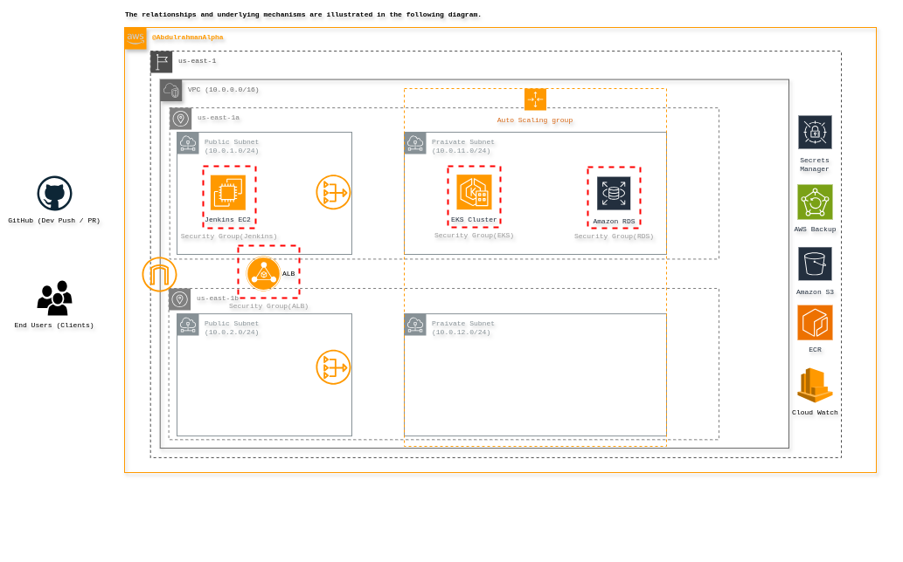

# 3-TIER-CLOUD-NATIVE

### A Production-Grade Cloud-Native Infrastructure with Terraform, Jenkins, and Kubernetes on AWS

This project demonstrates a **3-tier cloud-native application architecture** (Web, API, Database) deployed on **AWS** using **Infrastructure as Code (IaC)**, **CI/CD automation**, and **observability tools**.  
It’s designed as a **real-world DevOps portfolio project** showcasing infrastructure provisioning, containerization, orchestration, and continuous deployment.

---

## Architecture Overview

The system follows a **modular 3-tier architecture**:

- **Frontend (Web):** Vue.js SPA served through NGINX
- **Backend (API):** Python Flask REST API
- **Database (DB):** PostgreSQL
- **CI/CD:** Jenkins pipelines with automated build, test, security scan, and deployment
- **Infrastructure:** AWS (VPC, EKS, RDS, ECR, S3)
- **Monitoring:** Prometheus + Grafana + Alertmanager
- **Provisioning:** Terraform and Ansible

---

## Project Overview


---

### Architecture Diagram



---

## Features

- **Full Infrastructure Automation** with Terraform
- **Reusable IaC Modules** for VPC, RDS, ECR, EKS, EC2, and S3
- **Jenkins CI/CD Pipelines** with shell scripts for:
  - Build & push Docker images to ECR
  - Security scan with Trivy
  - Deploy to EKS using `kubectl` and Helm
- **Kubernetes Deployment** for Web and API with HPA, Ingress, and Secrets
- **Monitoring Stack:** Prometheus + Grafana + Alertmanager with custom dashboards
- **Secure Architecture** with VPC isolation, subnets, and IAM roles
- **Environment Separation** (Dev, Staging, Prod)

---

## Project Structure

```

3-tier-cloud-native/
├── app/                # Source code for web & API
├── docker-compose/     # Local development setup
├── docs/               # Architecture diagrams
├── infra/
│   ├── terraform/      # IaC modules and envs
│   └── ansible/        # Jenkins provisioning playbooks
├── jenkins/            # Jenkins pipelines and helper scripts
├── k8s/                # Helm charts and K8s manifests
└── monitoring/         # Prometheus & Grafana configurations

````

---

## Infrastructure (Terraform)

**AWS Services Used:**
- **VPC:** Custom network with public/private subnets and NAT Gateway
- **EKS:** Managed Kubernetes cluster for workload orchestration
- **RDS (PostgreSQL):** Managed relational database for persistence
- **ECR:** Container image registry for app images
- **S3:** Backup and artifact storage
- **EC2:** Jenkins controller host

**Terraform Modules:**
- `vpc/`
- `rds/`
- `ecr/`
- `s3_backup/`
- `ec2_jenkins/`

---

## CI/CD Pipeline (Jenkins)

**Pipeline Stages:**
1. **Checkout Code**
2. **Build Docker Image**
3. **Run Trivy Security Scan**
4. **Push Image to ECR**
5. **Deploy to EKS** using Helm or kubectl
6. **Post-deploy Notification**

**Scripts:**
- `jenkins/scripts/build_and_push.sh`
- `jenkins/scripts/deploy_to_eks.sh`
- `jenkins/scripts/trivy_scan.sh`

**Pipeline File:** `jenkins/Jenkinsfile`

---

## Kubernetes Deployment

Kubernetes manifests and Helm charts for:
- **Namespace, ConfigMap, Secrets**
- **Deployments (web, api)**
- **Services**
- **Ingress Controller (ALB Ingress)**
- **Horizontal Pod Autoscaler**
- **Network Policies**

---

## Monitoring & Observability

**Stack:**
- **Prometheus:** Metrics collection
- **Grafana:** Visualization dashboards
- **Alertmanager:** Alert routing and notifications

Predefined Grafana dashboards and Prometheus scrape configs are available under `monitoring/`.

---

## Local Development

You can spin up the entire stack locally using Docker Compose:

```bash
cd docker-compose
docker-compose up --build
````

Access:

* Frontend: `http://localhost:8080`
* API: `http://localhost:5000`
* Grafana: `http://localhost:3000`
* Prometheus: `http://localhost:9090`

---

##  Deployment Environments

| Environment | Purpose           | Location                               |
| ----------- | ----------------- | -------------------------------------- |
| **dev**     | Developer testing | `infra/terraform/environments/dev`     |
| **staging** | Pre-production    | `infra/terraform/environments/staging` |
| **prod**    | Production-ready  | `infra/terraform/environments/prod`    |

---

## Security

* Trivy used for container vulnerability scanning
* AWS IAM roles for least privilege
* Network isolation through private subnets
* SSL/TLS via Ingress Controller and ACM

---

## Tech Stack

| Category       | Technologies                      |
| -------------- | --------------------------------- |
| **IaC**        | Terraform, Ansible                |
| **Cloud**      | AWS (EKS, RDS, EC2, ECR, S3, VPC) |
| **Containers** | Docker, Kubernetes                |
| **CI/CD**      | Jenkins                           |
| **Monitoring** | Prometheus, Grafana, Alertmanager |
| **Backend**    | Python Flask                      |
| **Frontend**   | Vue.js                            |
| **Database**   | PostgreSQL                        |

---

## 🧑‍💻 Author

**Abdulrahman A. Muhamad**

DevOps · DevSecOps · Cloud · SRE

🔗 [LinkedIn](https://www.linkedin.com/in/abdulrahmanalpha) | [GitHub](https://github.com/AbdulrahmanAlpha) | [Portfolio](https://abdulrahman-alpha.web.app)

---

## 📝 License

This project is licensed under the **MIT License**.
See [LICENSE](./LICENSE.txt) for details.

---

## ⭐ Contribute

Want to contribute or fork this for your own project?
Feel free to submit pull requests or suggestions!

---

### 🏗️ Keywords / Topics

`#terraform` `#aws` `#kubernetes` `#jenkins` `#cicd` `#devops` `#prometheus` `#grafana` `#infrastructure-as-code` `#cloud-native`

